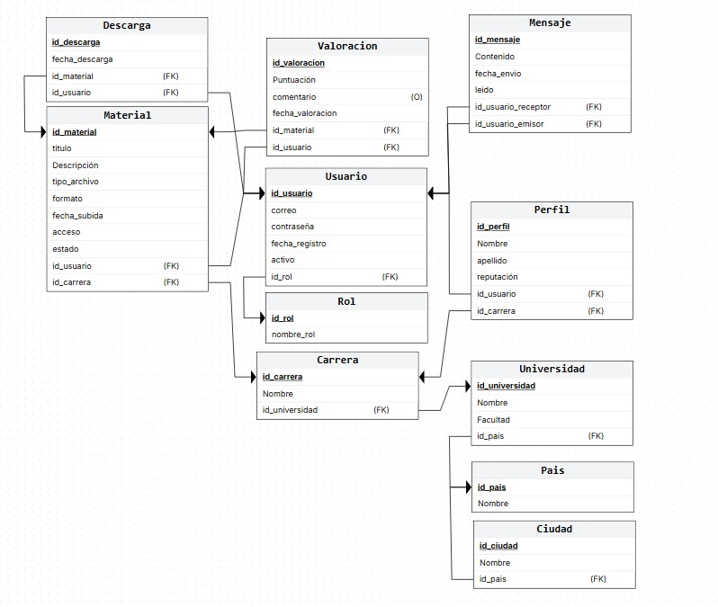

# Universidad Nacional del Nordeste
## Facultad de Ciencias Exactas y Naturales y Agrimensura

# PROYECTO: Sistema de intercambio de apuntes

### Participantes:
- Acosta, Lara
- Aranda, Pablo 
- Benitez, Valentina
- Bolo, Tomas

**Profesor de Catedra:** Dario Villegas 

**Materia:** Base de Datos  
**Carrera:** Licenciatura en Sistemas de Información  
**Fecha:** 11 de Noviembre de 2025

---

## ÍNDICE

1. [CAPÍTULO I: INTRODUCCIÓN](#capítulo-i-introducción)
    - [1.2. Tema del sistema](#12-tema-del-sistema)
    - [1.3. Planteamiento del problema](#13-planteamiento-del-problema)
    - [1.4. Objetivo del trabajo práctico](#14-objetivo-del-trabajo-práctico)
2. [CAPÍTULO II: MARCO CONCEPTUAL O REFERENCIAL](#capítulo-ii--marco-conceptual-o-referencial)
    - [2.1 Modelo relacional y normalización](#21-modelo-relacional-y-normalización)
    - [2.2 Manejo de permisos y roles](#22-manejo-de-permisos-y-roles-en-bases-de-datos)
    - [2.3 Procedimientos y funciones](#23-procedimientos-y-funciones-almacenadas)
    - [2.4 Optimización con índices](#24-optimización-de-consultas-con-índices)
3. [CAPÍTULO III: METODOLOGÍA SEGUIDA](#capítulo-iii--metodología-seguida)
4. [CAPÍTULO IV: DESARROLLO DEL TEMA / RESULTADOS](#capítulo-iv--desarrollo-del-tema--resultados)
5. [CAPÍTULO V: CONCLUSIONES](#capítulo-v--conclusiones)
6. [CAPÍTULO VI: BIBLIOGRAFÍA](#capítulo-vi--bibliografía)

---

# CAPÍTULO I: INTRODUCCIÓN

## 1.2. Tema del sistema

El siguiente proyecto se centrará en investigar y resolver una problemática de un prototipo de aplicación diseñada para compartir material académico entre estudiantes.  
La aplicación propuesta es una plataforma digital colaborativa destinada a estudiantes universitarios y terciarios. Su propósito principal es facilitar el acceso, la publicación y el intercambio de materiales académicos como apuntes, parciales, exámenes y libros, de manera segura, organizada y confiable.  

La plataforma permitirá a los usuarios registrarse, subir materiales, descargarlos, valorarlos y mantener un perfil con historial de actividad. Además, contará con un sistema de administración encargado de gestionar los contenidos, controlar los reportes y el correcto funcionamiento del sistema en sí y la comunidad de los usuarios.  

## 1.3. Planteamiento del problema

Se buscará como objetivo resolver y proponer un modelo para lograr una base de datos segura y precisa para una aplicación como la propuesta. Dado que la naturaleza de la aplicación involucra múltiples interacciones con datos sensibles (información personal de usuarios, archivos académicos, registros de reputación y descargas), el proyecto se centrará en investigar y aplicar conceptos clave de bases de datos: claves, cardinalidad, restricciones, normalizaciones, etc.  

Se buscará identificar y resolver problemáticas propias del diseño del modelo de datos, tales como la correcta estructuración de la información sobre los usuarios, la gestión de materiales académicos y su relación con carreras y materias, así como la implementación de filtros y criterios de búsqueda eficientes. Esto implica definir adecuadamente las entidades, sus atributos y las relaciones entre ellas, asegurando la integridad, consistencia y facilidad de consulta de los datos en la base.  

## 1.4. Objetivo del trabajo práctico

El presente trabajo tiene como finalidad diseñar un modelo de base de datos eficiente y coherente para una plataforma académica orientada a estudiantes universitarios. A través de este trabajo, el lector podrá comprender cómo se organiza la información, cómo se definen las entidades y sus relaciones, y cómo se asegura la integridad y accesibilidad de los datos.  

### I. Objetivo General

Diseñar e implementar un modelo de base de datos que permita gestionar de manera eficiente la información sobre usuarios, materiales académicos, carreras y materias, asegurando la integridad, consistencia y facilidad de consulta de los datos.  

### II. Objetivos Específicos

- Identificar y definir las entidades principales del sistema, junto con sus atributos y relaciones.  
- Garantizar la correcta administración de los materiales académicos y su vinculación con usuarios, carreras y materias.  
- Implementar filtros y criterios de búsqueda eficientes que permitan consultas rápidas y precisas.  
- Asegurar la integridad y consistencia de los datos mediante restricciones, claves primarias y foráneas adecuadas.  
- Documentar el modelo de datos para facilitar su comprensión y posible implementación futura.  

# CAPÍTULO II – MARCO CONCEPTUAL O REFERENCIAL 

Este capítulo presenta los conceptos fundamentales que sirven de base al desarrollo del modelo y a la investigación asociada a los temas de manejo de permisos y roles, procedimientos y funciones almacenadas y optimización de consultas mediante índices. El propósito es ofrecer un marco de referencia claro y coherente que permita comprender las decisiones de diseño y la implementación realizadas en el proyecto. 

## 2.1 Modelo relacional y normalización 

El modelo relacional organiza la información en tablas vinculadas mediante claves primarias y foráneas, lo que permite representar de manera estructurada los datos del mundo real. Su objetivo es garantizar coherencia, integridad y facilidad de acceso a la información almacenada.
Un aspecto central de este modelo es la normalización, un proceso que busca eliminar redundancias y dependencias innecesarias en los datos. A través de las formas normales, se asegura que cada entidad esté correctamente definida, evitando duplicaciones que dificulten el mantenimiento de la base.
La normalización será esencial para modelar adecuadamente la relación entre usuarios, materiales, carreras y materias. De esta forma, se asegura que un mismo material no aparezca repetido en distintas tablas y que las consultas puedan ejecutarse de manera más eficiente y sin inconsistencias.

## 2.2 Manejo de permisos y roles en bases de datos 

La seguridad en un sistema de gestión de bases de datos se implementa principalmente mediante permisos y roles. Los permisos definen qué operaciones puede realizar un usuario sobre los objetos de la base (consultar, insertar, modificar, eliminar, ejecutar). Los roles, en cambio, agrupan un conjunto de permisos, simplificando la administración de accesos.
Este mecanismo resulta fundamental para garantizar que cada usuario acceda únicamente a la información que necesita, evitando accesos indebidos y protegiendo la integridad de los datos.
La definición de permisos y roles permitirá distinguir entre estudiantes y administradores. Los estudiantes podrán subir, descargar y valorar materiales, mientras que los administradores contarán con privilegios para moderar contenidos, resolver reportes y gestionar la plataforma en general. 

## 2.3 Procedimientos y funciones almacenadas 

Los procedimientos almacenados son bloques de instrucciones SQL que se guardan y ejecutan en el servidor. Permiten centralizar operaciones frecuentes o críticas, lo que reduce la duplicación de código y mejora la eficiencia. Las funciones almacenadas, por su parte, devuelven un valor específico y pueden integrarse en consultas para realizar cálculos o transformaciones de datos.
Su uso aporta varias ventajas: minimizan errores al concentrar la lógica en un único lugar, aumentan la eficiencia al ejecutarse directamente en el servidor y refuerzan la seguridad al evitar accesos directos a las tablas.

Es clave para resolver ciertos aspectos del modelo, los procedimientos y funciones almacenadas pueden aplicarse para validar registros de usuarios, calcular estadísticas de descargas, gestionar el historial de actividad o generar reportes administrativos de forma más segura y eficiente.

## 2.4 Optimización de consultas con índices 

Un índice es una estructura que acelera la recuperación de información en una tabla, funcionando de manera similar al índice de un libro. Gracias a ellos, no es necesario recorrer fila por fila cada vez que se ejecuta una consulta. Existen distintos tipos de índices, como los agrupados, no agrupados y compuestos, que se aplican según la naturaleza de las consultas.
La principal ventaja de los índices es que mejoran notablemente el rendimiento en búsquedas frecuentes o sobre grandes volúmenes de datos. Sin embargo, también generan un costo en almacenamiento y actualizaciones, por lo que deben diseñarse con criterio.
Los índices resultan clave para la optimizacion de las consultas relacionadas con la búsqueda de materiales. Dado que los usuarios suelen filtrar por carrera, materia o tipo de archivo, contar con índices adecuados permitirá acelerar estas operaciones y mejorar la experiencia de uso de la plataforma.

# CAPÍTULO III – METODOLOGÍA SEGUIDA

## 3.1 Descripción del proceso de realización

Para la elaboración del presente Trabajo Práctico, el equipo siguió un enfoque estructurado dividido en varias etapas, asegurando la cobertura de todos los requisitos de la cátedra:

1.  **Análisis de Requisitos:** Se comenzó con reuniones grupales para definir el alcance del sistema de intercambio de apuntes. Se identificaron los actores principales (estudiantes y administradores) y los objetos de negocio (apuntes, materias, carreras).
2.  **Diseño Conceptual:** Se elaboró un Diagrama Entidad-Relación (DER) preliminar para visualizar las entidades y sus interacciones.
3.  **Diseño Lógico y Normalización:** Se transformó el DER al modelo relacional, aplicando las reglas de normalización (1FN, 2FN, 3FN) para eliminar redundancias y asegurar la integridad de los datos.
4.  **Implementación y Documentación:** Se procedió a la definición del diccionario de datos y la creación de los diagramas finales utilizando herramientas de software específicas.

Entre las dificultades encontradas, destacó la definición correcta de la cardinalidad en la relación entre "Usuarios" y "Materiales" para gestionar el historial de descargas sin duplicar información innecesaria, lo cual se resolvió mediante una tabla intermedia de transacciones.

## 3.2 Herramientas e Instrumentos utilizados

Para la recolección de información y el desarrollo técnico del proyecto se utilizaron los siguientes recursos:

* **Bibliografía de Cátedra:** Para la fundamentación teórica del Capítulo II.
* **Software de Diagramación:** Se utilizaron herramientas CASE (como *Draw.io* o *Microsoft Visio*) para la confección del diagrama relacional.
* **Motor de Base de Datos:** Se consultó la documentación de *SQL Server* para validar la sintaxis de tipos de datos y restricciones.
* **Procesadores de Texto:** Para la redacción y maquetación del informe final en formato Markdown y PDF.

# CAPÍTULO IV – DESARROLLO DEL TEMA / RESULTADOS

## 4.1 Descripción del Modelo Propuesto

Como resultado del análisis, se ha diseñado un esquema de base de datos relacional que soporta todas las operaciones de la plataforma. El núcleo del sistema gira en torno a tres entidades fuertes: `Usuario`, `Materia` y `Carrera`.

La gestión de los archivos se realiza a través de la entidad `Material`, la cual posee claves foráneas que la vinculan tanto al usuario que la subió como a la materia a la que pertenece. Esto permite realizar consultas complejas, como filtrar apuntes por carrera o listar los aportes de un estudiante específico.

## 4.2 Diagrama relacional 

A continuación, se presenta el esquema gráfico que ilustra las tablas, claves primarias (PK), claves foráneas (FK) y la cardinalidad de las relaciones:

## 4.3 Diccionario de datos

Para garantizar la correcta implementación física de la base de datos, se ha elaborado un diccionario de datos detallado. En este documento se especifican:
* Nombres de tablas y columnas.
* Tipos de datos (int, varchar, date, etc.).
* Restricciones de integridad (NOT NULL, UNIQUE).
* Descripciones funcionales de cada campo.

[Ver documento PDF - DICCIONARIO DE DATOS](doc/diccionario_datos.pdf)

# CAPÍTULO V – CONCLUSIONES

Tras finalizar el diseño y modelado de la base de datos para el sistema de intercambio de apuntes, se puede concluir que se han alcanzado satisfactoriamente los objetivos planteados al inicio del proyecto.

El modelo relacional obtenido cumple con los principios de normalización, lo que garantiza que la base de datos sea robusta frente a anomalías de actualización y redundancia de datos. La correcta definición de claves primarias y foráneas asegura la integridad referencial, impidiendo, por ejemplo, que existan materiales huérfanos sin una materia asociada.

Asimismo, la investigación realizada en el marco conceptual sobre procedimientos almacenados y roles ha permitido diseñar teóricamente un entorno seguro, donde los privilegios de administración están claramente separados de los de uso general.

En conclusión, nuestro proyecto propuesto no solo resuelve la problemática de organización de material académico, sino que también sienta una base sólida para el desarrollo futuro de la aplicación, permitiendo la integración de nuevas funcionalidades sin requerir cambios estructurales drásticos.

# CAPÍTULO VI – BIBLIOGRAFÍA

* Elmasri, R., & Navathe, S. B. (2007). *Fundamentos de Sistemas de Bases de Datos* (5ta ed.). Pearson Educación.
* Microsoft. (2025). *Documentación técnica de SQL Server*. Recuperado de [https://learn.microsoft.com/es-es/sql/](https://learn.microsoft.com/es-es/sql/)
* Date, C. J. (2001). *Introducción a los Sistemas de Bases de Datos*. Pearson Educación.